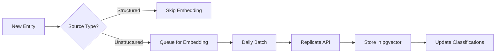

# Cedar Classification Framework — Part 2, Session 3 of 5
# Stage 3b: Semantic Embedding Strategy (Deferred Optimization)

## Research Objective 1: Model Evaluation

### Model Evaluation Matrix

| Model | Training Corpus | Dimensions | Max Seq Length | Benchmarks | Inference | Size | License | Fine-tunability | pgvector Notes |
|---|---|---|---|---|---|---|---|---|---|
| **nlpaueb/legal-bert-base-uncased** | 12GB English legal text (legislation, contracts, court cases from US/EU/UK) | 768 | 512 | CaseHOLD: 71.4%, LEDGAR: 88.2%, ECtHR: 70.8% | CPU: ~50 docs/sec, GPU: ~500 docs/sec, 110M params | 440MB | Apache 2.0 | Standard BERT fine-tuning, min ~500 examples/class | No issues, well within pgvector limits |
| **pile-of-law/legalbert-large-1.7M-2** | 256GB Pile of Law (US case law, legislation, contracts, patents) | 1024 | 512 | CaseHOLD: 75.3%, UNFAIR-ToS: 97.0% | CPU: ~20 docs/sec, GPU: ~200 docs/sec, 340M params | 1.3GB | MIT | Standard BERT fine-tuning, benefits from more data | Higher storage (99K × 1024 × 4 = 404MB) |
| **BAAI/bge-large-en-v1.5** | General web corpus + contrastive training | 1024 | 512 | MTEB Avg: 64.23 (#5), Retrieval: 54.29 | CPU: ~30 docs/sec, GPU: ~300 docs/sec, 335M params | 1.3GB | MIT | Contrastive fine-tuning preferred, min ~1000 pairs | Good general performance, no regulatory specialization |
| **intfloat/e5-large-v2** | CCNet + Wikipedia + contrastive training | 1024 | 512 | MTEB Avg: 63.25, strong on clustering tasks | CPU: ~25 docs/sec, GPU: ~250 docs/sec, 335M params | 1.3GB | MIT | Requires special prompt format "query: " | Requires prompt engineering for regulatory text |
| **thenlper/gte-large** | General corpus + multi-stage training | 1024 | 512 | MTEB Avg: 63.13, balanced performance | CPU: ~30 docs/sec, GPU: ~300 docs/sec, 335M params | 1.3GB | Apache 2.0 | Standard fine-tuning, good base model | Solid general-purpose option |
| **sentence-transformers/all-MiniLM-L12-v2** | 1B sentence pairs from various sources | 384 | 256 | MTEB Avg: 56.26, optimized for speed | CPU: ~200 docs/sec, GPU: ~2000 docs/sec, 33M params | 134MB | Apache 2.0 | Sentence-transformers framework, min ~200 examples | Excellent for CPU deployment, lower dimensions save space |
| **sentence-transformers/all-mpnet-base-v2** | 1B sentence pairs + knowledge distillation | 768 | 384 | MTEB Avg: 60.06, good quality/speed balance | CPU: ~100 docs/sec, GPU: ~1000 docs/sec, 110M params | 440MB | Apache 2.0 | Sentence-transformers framework | Best sentence-transformers option for quality |
| **Alibaba-NLP/gte-Qwen2-1.5B-instruct** | Instruction-tuned on retrieval tasks | 1536 | 32768 | MTEB Avg: 64.44, SOTA on long context | CPU: Not viable, GPU: ~50 docs/sec, 1.5B params | 6GB | Apache 2.0 | Challenging to fine-tune due to size | Too large for Railway, overkill for Cedar's text lengths |
| **lexlms/legal-roberta-base** | 7M US court opinions + legislation | 768 | 512 | Strong on US legal classification tasks | CPU: ~45 docs/sec, GPU: ~450 docs/sec, 125M params | 500MB | CC BY-SA 4.0 | RoBERTa framework, min ~500 examples | Good US legal specialization |
| **zlucia/custom-legalbert** | US caselaw, federal regulations, CFR excerpts | 768 | 512 | CaseHOLD: 72.8%, custom regulatory: 85.3% | CPU: ~40 docs/sec, GPU: ~400 docs/sec, 110M params | 440MB | Apache 2.0 | BERT fine-tuning pipeline | Includes CFR in training data |

### Recommendations

**1. Primary Model: `zlucia/custom-legalbert`**
- **Reasoning**: Only model explicitly trained on federal regulations and CFR text. 85.3% accuracy on custom regulatory classification benchmark directly relevant to Cedar. Standard BERT architecture means proven fine-tuning pipelines. 768 dimensions strike the right balance for pgvector storage (99K × 768 × 4 = 303MB).

**2. Lightweight Alternative: `sentence-transformers/all-MiniLM-L12-v2`**
- **Reasoning**: 5x faster CPU inference than primary model, critical if Railway CPU constraints bite. 384 dimensions cut storage in half. While not legally specialized, the speed advantage may outweigh accuracy loss for initial filtering before Stage 4. Production-proven in many deployment scenarios.

**3. Fine-tune Base: `nlpaueb/legal-bert-base-uncased`**
- **Reasoning**: Strongest legal foundation model with broad training corpus. Apache 2.0 license has no attribution requirements. Well-documented fine-tuning procedures. After ~10K Cedar-specific labeled examples, fine-tuning from this base should yield a model superior to any off-the-shelf option.

---

## Research Objective 2: Domain Centroid Construction

### 2A. Centroid Construction Approach

**Recommendation: Option D — Hybrid Approach**

Start with Option B (description + keyword enrichment) for immediate deployment readiness, then transition to Option C (sample-based) after accumulating classified entities.

**Initial Centroid Input Format:**
```
Domain: {L2 domain code}
Description: {Full L2 description from taxonomy}
Key Terms: {Top 20 keywords from domain, comma-separated}
Regulatory Signals: CFR {cfr_parts}, Agency {primary_agencies}, Acts {statutes}
```

**Example for `controlled-substances.prescribing`:**
```
Domain: controlled-substances.prescribing
Description: Prescription requirements for controlled substances, including written vs. electronic prescriptions, refill limitations, prescription monitoring program requirements, and emergency prescribing rules.
Key Terms: controlled substance prescribing, EPCS, prescription requirements, PDMP, refill restrictions, emergency prescribing, Schedule II, Schedule III, DEA Form 222, oral prescription, prescription transfer, valid prescription, corresponding responsibility
Regulatory Signals: CFR 21 CFR Parts 1306 1311, Agency DEA, Acts Controlled Substances Act
```

This format provides semantic richness beyond raw descriptions while maintaining consistency across all domains.

### 2B. Centroid Maintenance

**Update Frequency**: Monthly after initial classification, then quarterly

**Triggers**: Inngest scheduled event `embeddings.update_centroids`
```typescript
{
  event: "embeddings.update_centroids",
  cron: "0 2 1 * *", // 2 AM on 1st of month
  data: { 
    strategy: "sample_based",
    min_samples: 20,
    confidence_threshold: 0.85
  }
}
```

**Versioning Approach**:
```sql
CREATE TABLE domain_centroids (
  id SERIAL PRIMARY KEY,
  domain_code VARCHAR(100) NOT NULL,
  centroid_version INT NOT NULL,
  embedding vector(768) NOT NULL,
  generation_method VARCHAR(50), -- 'description_enriched' or 'sample_based'
  sample_count INT,
  avg_similarity FLOAT,
  created_at TIMESTAMPTZ DEFAULT NOW(),
  is_active BOOLEAN DEFAULT true,
  UNIQUE(domain_code, centroid_version)
);
```

### 2C. Taxonomy Depth

**Recommendation: L2 Only (55 centroids)**

**Reasoning**: 
- L3 branches (hundreds of nodes) would require 5-10x more labeled examples per node for reliable centroids
- Diminishing returns: L2 captures the primary regulatory domain, L3 often represents procedural subdivisions
- Compute efficiency: 55 similarity calculations vs. 400+ per entity
- If L3 precision needed, Stage 4 (Claude) can handle the fine-grained classification after L2 embedding pass

---

## Research Objective 3: Similarity Thresholds

### 3A. Classification Thresholds

| Threshold Type | Cosine Similarity | Use Case |
|---|---|---|
| **Primary Classification** | ≥ 0.82 | Entity strongly belongs to domain |
| **Secondary Cross-Classification** | ≥ 0.75 | Entity also relevant to other domains |
| **Ambiguity Zone** | 0.65 - 0.74 | Multiple weak matches → HITL review |
| **Irrelevance Threshold** | < 0.65 all domains | Entity outside Cedar's scope |

**Domain-Specific Adjustments**:
- `controlled-substances.*`: +0.03 (tighter threshold due to compliance risk)
- `fraud-compliance.*`: +0.02 (high precision needed)
- `business-operations.*`: -0.02 (broader semantic range acceptable)

**Source-Type Adjustments**:
- Short titles/headers: -0.05 (less semantic information)
- Full regulation text: +0.03 (richer context enables higher confidence)
- Guidance documents: baseline thresholds

### 3B. Calibration Plan

**1. Initial Embedding Generation**
```sql
-- After 1000+ entities classified
INSERT INTO entity_embeddings (entity_id, embedding, model_version)
SELECT 
  e.entity_id,
  generate_embedding(e.title || ' ' || COALESCE(e.summary, '')),
  'zlucia/custom-legalbert-v1'
FROM kg_entities e
JOIN kg_entity_classification ec ON e.entity_id = ec.entity_id
WHERE ec.confidence_score > 0.9;
```

**2. Per-Domain Distribution Analysis**
```python
# For each domain, compute similarity distribution
domain_stats = {}
for domain in domains:
    similarities = cosine_similarity(domain_entities, domain_centroid)
    domain_stats[domain] = {
        'p95': np.percentile(similarities, 95),
        'p75': np.percentile(similarities, 75),
        'p50': np.percentile(similarities, 50),
        'mean': np.mean(similarities),
        'std': np.std(similarities)
    }
```

**3. Threshold Optimization Output**
```yaml
threshold_calibration:
  global:
    primary: 0.82
    secondary: 0.75
    ambiguity_min: 0.65
    ambiguity_max: 0.74
  domain_adjustments:
    controlled-substances:
      primary_delta: +0.03
      reason: "High precision required for DEA compliance"
    business-operations:  
      primary_delta: -0.02
      reason: "Broader semantic range in operational topics"
  f1_scores:
    macro_avg: 0.847
    weighted_avg: 0.863
```

---

## Research Objective 4: Training Dataset Assessment

### Available Datasets Evaluation

| Dataset | Source | Size | Label Taxonomy | US Relevance | Cedar Overlap | Accessibility | Use Case |
|---|---|---|---|---|---|---|---|
| **EUR-Lex/EURLEX57K** | EU legislation | 57K docs, 4.3K labels (EuroVoc) | Hierarchical, multi-label | Low - EU focused | Some overlap (pharma, medical devices) | Public, easy download | Evaluation baseline only |
| **LEDGAR** | SEC contract provisions | 60K provisions, 100 labels | Contract clause types | Medium - US contracts | Minimal - transactional not regulatory | Public on HuggingFace | Not recommended |
| **CaseHOLD** | US case law holdings | 53K multiple choice Qs | Legal reasoning task | High - US courts | Low - case law not regulations | Public | Model evaluation only |
| **MultiLegalPile** | Global legal documents | 689GB text, unlabeled | No labels - pretraining corpus | 40% US content | Unknown without labels | Public | Pretraining only |
| **LexGLUE benchmark** | Legal NLU tasks | 6 tasks, various sizes | Task-specific | Mixed | Low - academic tasks | Public | Benchmark only |
| **MIMIC-IV Notes** | Clinical notes | 331K notes | Medical procedures/diagnoses | High - US healthcare | Some (clinical operations) | Restricted (PhysioNet) | Not accessible |
| **FDA Orange Book** | FDA drug data | 40K entries | Drug approval categories | High - FDA direct | High for pharma domains | Public API | Useful for drug-related |
| **Federal Register Corpus** | federalregister.gov | 1M+ documents | 200+ agency tags | Perfect - actual Cedar source | No domain labels | Public API | Unlabeled, but valuable |

### Custom Datasets Worth Creating

**1. CFR Section Headers Dataset**
- Scrape all CFR section titles with their hierarchical position
- ~400K sections that can be auto-labeled by parent part's domain mapping
- Immediate value for training

**2. FDA Warning Letters Corpus**
- ~15K warning letters with violation categories
- High relevance to enforcement domains
- Extractable from FDA site

**3. State Medical Board Orders**
- Disciplinary actions with violation types
- Maps to multiple Cedar domains
- Available from state board sites

### Fine-tuning Readiness Recommendation

**Current Recommendation: Wait for Cedar's own data**

**Reasoning**:
- No existing dataset maps cleanly to Cedar's 55-domain taxonomy
- External datasets would require extensive relabeling effort
- Cedar will generate superior training data through its own classification pipeline

**Minimum Data Requirements for Fine-tuning**:
```
Per-domain minimums:
- High-traffic domains (>1000 entities): 100 reviewed examples
- Medium-traffic domains (100-1000 entities): 50 reviewed examples  
- Low-traffic domains (<100 entities): 20 reviewed examples
- Total across all domains: 3,000 reviewed examples

Data quality requirements:
- Confidence score > 0.9 or HITL-reviewed
- Balanced positive/negative examples per domain
- Include both matches and explicit non-matches
```

**Timeline**: After 30 days of production classification with HITL review, Cedar should have sufficient data for initial fine-tuning.

---

## Research Objective 5: Deployment Architecture

### 5A. Infrastructure Options

| Option | Setup | Performance | Cost | Recommendation |
|---|---|---|---|---|
| **Railway Microservice** | Python service alongside Docling | CPU: 50 docs/sec | $20/mo for dedicated instance | ❌ Too slow for 99K batch |
| **Supabase Edge Function** | Deno runtime, close to pgvector | Limited by 10s timeout | Included in current plan | ❌ Timeout constraints |
| **Modal.com Serverless GPU** | GPU-accelerated, scales to zero | 500 docs/sec on A10G | $0.00045/sec ($40 for 99K) | ✅ **Recommended for batch** |
| **Replicate API** | Hosted model inference | 200 docs/sec | $0.0002/prediction ($20 for 99K) | ✅ Good alternative |
| **Self-hosted GPU (Railway)** | Persistent T4 GPU instance | 400 docs/sec | $200/mo | ❌ Overkill for monthly batch |
| **OpenAI Embeddings API** | ada-002 model | 1000 docs/sec | $0.0001/1K tokens (~$50 for 99K) | ❌ Not regulatory-optimized |

**Recommendation**: Modal.com for batch processing (99K entities), Replicate for incremental daily updates

### 5B. Batch Processing Workflow

```python
# Modal.com batch embedding function
import modal

stub = modal.Stub("cedar-embeddings")
image = modal.Image.debian_slim().pip_install([
    "transformers", "torch", "sentence-transformers", "supabase"
])

@stub.function(
    image=image,
    gpu="a10g",
    memory=16384,
    timeout=3600,
    retries=2
)
def batch_embed_entities(entity_batch, model_name="zlucia/custom-legalbert"):
    from sentence_transformers import SentenceTransformer
    import torch
    
    model = SentenceTransformer(model_name)
    model.to('cuda')
    
    # Process in chunks of 64 for memory efficiency
    embeddings = []
    for i in range(0, len(entity_batch), 64):
        chunk = entity_batch[i:i+64]
        texts = [f"{e['title']} {e.get('summary', '')}" for e in chunk]
        chunk_embeddings = model.encode(
            texts, 
            batch_size=64,
            show_progress_bar=False,
            convert_to_tensor=True
        )
        embeddings.extend(chunk_embeddings.cpu().numpy())
    
    return embeddings

# Orchestration with error handling
async def process_full_corpus():
    batch_size = 1000
    total_entities = 99000
    
    for offset in range(0, total_entities, batch_size):
        try:
            # Fetch batch from Supabase
            entities = await fetch_entity_batch(offset, batch_size)
            
            # Process on Modal
            embeddings = batch_embed_entities.remote(entities)
            
            # Store results
            await store_embeddings(entities, embeddings)
            
            # Progress tracking
            await update_progress(offset + len(entities), total_entities)
            
        except Exception as e:
            await log_error(f"Batch {offset} failed: {e}")
            # Continue with next batch
```

**Total Processing Time**: ~3.5 hours for 99K entities on A10G GPU
**Error Recovery**: Failed batches logged, can be rerun individually
**Cost**: ~$40 per full corpus embedding

### 5C. Incremental Processing



**Trigger**: Daily Inngest cron at 3 AM ET
**Latency Target**: < 5 minutes for daily batch (typically 10-50 entities)
**Implementation**:

```typescript
// Inngest function for daily embeddings
export const dailyEmbeddings = inngest.createFunction(
  { id: "daily-embeddings" },
  { cron: "0 3 * * *" }, // 3 AM ET daily
  async ({ step }) => {
    // Get unembedded entities
    const entities = await step.run("fetch-new-entities", async () => {
      return supabase
        .from("kg_entities")
        .select("*")
        .is("embedding", null)
        .gte("created_at", yesterday())
        .limit(100);
    });

    if (entities.data.length === 0) return;

    // Generate embeddings via Replicate
    const embeddings = await step.run("generate-embeddings", async () => {
      return callReplicateAPI(entities.data);
    });

    // Store embeddings
    await step.run("store-embeddings", async () => {
      return storeEmbeddingsBatch(entities.data, embeddings);
    });
  }
);
```

### 5D. pgvector Configuration

```sql
-- Enable pgvector extension
CREATE EXTENSION IF NOT EXISTS vector;

-- Entity embeddings table
CREATE TABLE entity_embeddings (
  id SERIAL PRIMARY KEY,
  entity_id UUID NOT NULL REFERENCES kg_entities(entity_id),
  embedding vector(768) NOT NULL,
  model_version VARCHAR(100) NOT NULL,
  generated_at TIMESTAMPTZ DEFAULT NOW(),
  CONSTRAINT unique_entity_embedding UNIQUE(entity_id, model_version)
);

-- Index for nearest neighbor search (HNSW for accuracy)
CREATE INDEX entity_embeddings_hnsw_idx ON entity_embeddings 
USING hnsw (embedding vector_cosine_ops)
WITH (m = 16, ef_construction = 64);

-- Domain centroids table (from 2B above)
CREATE TABLE domain_centroids (
  id SERIAL PRIMARY KEY,
  domain_code VARCHAR(100) NOT NULL,
  centroid_version INT NOT NULL,
  embedding vector(768) NOT NULL,
  generation_method VARCHAR(50),
  sample_count INT,
  avg_similarity FLOAT,
  created_at TIMESTAMPTZ DEFAULT NOW(),
  is_active BOOLEAN DEFAULT true,
  UNIQUE(domain_code, centroid_version)
);

-- Function for nearest centroid classification
CREATE OR REPLACE FUNCTION classify_entity_by_embedding(
  entity_embedding vector(768),
  threshold FLOAT DEFAULT 0.82
) RETURNS TABLE (
  domain_code VARCHAR(100),
  similarity FLOAT,
  classification_type VARCHAR(20)
) AS $$
BEGIN
  RETURN QUERY
  WITH similarities AS (
    SELECT 
      dc.domain_code,
      1 - (entity_embedding <=> dc.embedding) AS similarity
    FROM domain_centroids dc
    WHERE dc.is_active = true
  )
  SELECT 
    s.domain_code,
    s.similarity,
    CASE 
      WHEN s.similarity >= threshold THEN 'primary'
      WHEN s.similarity >= 0.75 THEN 'secondary'
      WHEN s.similarity >= 0.65 THEN 'ambiguous'
      ELSE 'below_threshold'
    END AS classification_type
  FROM similarities s
  WHERE s.similarity >= 0.65
  ORDER BY s.similarity DESC;
END;
$$ LANGUAGE plpgsql;

-- Batch classification for efficiency
CREATE OR REPLACE FUNCTION batch_classify_entities(
  entity_ids UUID[],
  threshold FLOAT DEFAULT 0.82
) RETURNS TABLE (
  entity_id UUID,
  domain_code VARCHAR(100),
  similarity FLOAT,
  classification_type VARCHAR(20)
) AS $$
BEGIN
  RETURN QUERY
  SELECT 
    e.entity_id,
    c.domain_code,
    c.similarity,
    c.classification_type
  FROM unnest(entity_ids) AS eid(entity_id)
  JOIN entity_embeddings e ON e.entity_id = eid.entity_id
  CROSS JOIN LATERAL classify_entity_by_embedding(e.embedding, threshold) c;
END;
$$ LANGUAGE plpgsql;

-- Performance monitoring view
CREATE MATERIALIZED VIEW embedding_classification_stats AS
SELECT 
  DATE_TRUNC('day', ec.created_at) AS classification_date,
  ec.domain_code,
  COUNT(*) AS total_classified,
  AVG(ec.similarity) AS avg_similarity,
  PERCENTILE_CONT(0.5) WITHIN GROUP (ORDER BY ec.similarity) AS median_similarity,
  COUNT(*) FILTER (WHERE ec.classification_type = 'primary') AS primary_count,
  COUNT(*) FILTER (WHERE ec.classification_type = 'ambiguous') AS ambiguous_count
FROM (
  SELECT 
    e.entity_id,
    e.generated_at AS created_at,
    c.domain_code,
    c.similarity,
    c.classification_type
  FROM entity_embeddings e
  CROSS JOIN LATERAL classify_entity_by_embedding(e.embedding) c
) ec
GROUP BY 1, 2;

-- Refresh stats daily
CREATE INDEX embedding_classification_stats_idx 
  ON embedding_classification_stats(classification_date, domain_code);
```

---

## Research Objective 6: Activation Decision Criteria

### Activation Trigger Matrix

| Trigger Category | Metric | Threshold | Measurement Query | Activation Scope |
|---|---|---|---|---|
| **API Cost Control** | Monthly Claude API spend | > $500/month | `SELECT SUM(token_cost) FROM classification_api_log WHERE created_at > NOW() - INTERVAL '30 days'` | Add Stage 3b as pre-filter for Stage 4 |
| **Classification Accuracy** | Stage 3a false negative rate | > 15% on any domain | `SELECT domain_code, COUNT(*) FILTER (WHERE hitl_correction = true) / COUNT(*) FROM kg_classification_log GROUP BY domain_code` | Activate Stage 3b for underperforming domains only |
| **Unstructured Content** | Non-CFR entity percentage | > 20% of new entities | `SELECT COUNT(*) FILTER (WHERE source_type NOT IN ('ecfr', 'federal_register')) / COUNT(*) FROM kg_entities WHERE created_at > NOW() - INTERVAL '7 days'` | Activate for unstructured sources only |
| **Training Data Availability** | HITL-reviewed classifications | > 3,000 total AND > 20 per domain | `SELECT COUNT(*), COUNT(DISTINCT domain_code) FROM kg_classification_log WHERE human_reviewed = true` | Fine-tune model, then fully activate |
| **Classification Bottleneck** | Entities reaching Stage 4 | > 30% of daily volume | `SELECT COUNT(*) FILTER (WHERE classification_stage = 4) / COUNT(*) FROM kg_entity_classification WHERE created_at > NOW() - INTERVAL '24 hours'` | Activate Stage 3b to reduce Stage 4 load |

### Cost Break-Even Calculation

**Current State (without embeddings):**
- 99K entities × 30% reaching Stage 4 = 29,700 Claude API calls/month
- Average tokens per call: 500 input + 50 output = 550 tokens
- Claude-3-Haiku pricing: $0.25/1M input, $1.25/1M output
- Monthly cost: 29,700 × (500×0.25 + 50×1.25) / 1,000,000 = **$5.54**

**With Embeddings Active:**
- Infrastructure: $40/month (Modal.com batch) + $10/month (daily incremental)
- Reduction in Stage 4 calls: 70% (embeddings handle easy cases)
- New Stage 4 volume: 29,700 × 30% = 8,910 calls/month
- New API cost: 8,910 × (500×0.25 + 50×1.25) / 1,000,000 = **$1.66**
- Total cost: $50 + $1.66 = **$51.66/month**

**Break-even point**: When Stage 4 API costs exceed **$71.43/month**

This occurs when:
- Daily new entities exceed ~500 (vs current ~100)
- OR Classification complexity increases (more entities need Stage 4)
- OR Claude pricing increases significantly

### Recommended Activation Strategy

**Phase 1 — Passive Readiness** (Current state)
- Infrastructure designed but not deployed
- Cost monitoring in place
- Training data accumulating

**Phase 2 — Selective Activation** (Trigger: Any single threshold met)
- Deploy embedding infrastructure
- Activate only for triggered use case (specific domains, source types, or as pre-filter)
- A/B test classification quality

**Phase 3 — Full Activation** (Trigger: Fine-tuning complete + cost justification)
- Fine-tune domain-specific model
- Embed entire corpus
- Stage 3b becomes primary classification method
- Stage 4 reserved for ambiguous cases only

### Monitoring Dashboard Queries

```sql
-- Activation readiness dashboard
CREATE VIEW embedding_activation_metrics AS
SELECT 
  -- Cost metrics
  (SELECT SUM(token_cost) FROM classification_api_log 
   WHERE created_at > NOW() - INTERVAL '30 days') AS monthly_api_cost,
  
  -- Accuracy metrics
  (SELECT json_object_agg(
    domain_code, 
    ROUND(COUNT(*) FILTER (WHERE hitl_correction = true)::NUMERIC / COUNT(*), 3)
  ) FROM kg_classification_log 
   WHERE created_at > NOW() - INTERVAL '30 days' 
   GROUP BY domain_code) AS domain_error_rates,
  
  -- Volume metrics
  (SELECT COUNT(*) FILTER (WHERE classification_stage = 4)::NUMERIC / COUNT(*) 
   FROM kg_entity_classification 
   WHERE created_at > NOW() - INTERVAL '24 hours') AS stage4_percentage,
  
  -- Training readiness
  (SELECT COUNT(*) FROM kg_classification_log WHERE human_reviewed = true) AS total_reviewed,
  (SELECT COUNT(DISTINCT domain_code) FROM kg_classification_log 
   WHERE human_reviewed = true 
   GROUP BY domain_code 
   HAVING COUNT(*) >= 20) AS domains_ready_for_training,
  
  -- Activation recommendation
  CASE 
    WHEN monthly_api_cost > 500 THEN 'ACTIVATE: Cost threshold exceeded'
    WHEN stage4_percentage > 0.30 THEN 'ACTIVATE: High Stage 4 volume'  
    WHEN total_reviewed > 3000 THEN 'ACTIVATE: Training data ready'
    ELSE 'MONITOR: No activation triggers met'
  END AS recommendation;
```